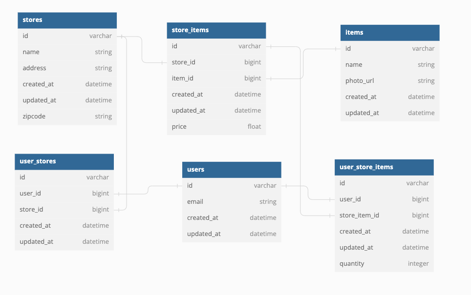

# Description
This is the back-end API for our Frugal Foods application. For for detailed information about the application please visit the [frugal foods front-end repository](https://github.com/Frugal-Foods/frugal-foods-fe).

This app includes a PostgreSQL database that stores users, stores, items, store items, user store items, and user stores information for the app. Store and product information are provided by consumption of both the [Target](https://www.redcircleapi.com/docs/target-product-data-api/overview) and [Kroger](https://developer.kroger.com/reference/) API's. This app consolidates the data provided by the external API's to be consumed by our front end and served to the end user. This prototype currently has two zipcodes available for demo: '80108' and '80206'.

# Links
[Frugal Foods BE deployment](https://frugal-foods-be.fly.dev/)

[Frugal Foods FE repository](https://github.com/Frugal-Foods/frugal-foods-fe)

## Technologies Used
- Rails 5.2.8
- Ruby 2.7.4
- PostgreSQL Database
- CircleCI for CI/CD
- Fly.io for deployment

## Schema 



## Local Setup Directions

1) Clone down the repo.
```
git clone git@github.com:Frugal-Foods/Frugal-Foods-BE.git
```
2) Switch your working directory to the root directory.
```
cd Frugal-Foods-BE/
```
(If you have not installed Ruby before, you can follow [this tutorial](https://stackify.com/install-ruby-on-your-mac-everything-you-need-to-get-going/) (for Mac computers).<br>
3) Install bundler if you haven't before.
```
gem install bundler
```
4) Install the project's gem dependencies.
```
bundle install
```
5) Set up the database.
```
rails db:{create,migrate}
```
6) Seed the DB (*prototype version only*).
```
rails json_load:all
```
7) Run the Rails server.
```
rails s
```
Follow the setup instructions for the [frugal foods front-end repository](https://github.com/Frugal-Foods/frugal-foods-fe) in order to make queries to the [frugal foods API](https://frugal-foods-be.fly.dev/).

You can also access queries through Postman by sending a POST request to `localhost:3000/graphql` and sending the query (shown below) in the body of your request.

## Future goals
- Due to rate limiting for free usage of both the Target and Kroger API's, our prototype only includes data from two zipcodes. Our goal moving forward to make this application more dynamic is to make live API calls to return data for any user in any zipcode.
- Implement authentication, allowing a user to create an account and have their popular stores and items remembered
- Implement 'shop by department' feature that allows user to browse all products for a store along with the ability to search for a specific item.
- Collect data for other popular grocery stores to allow the user more options when choosing stores near them.
- Implement 'cheapest in one stop' feature that allows a user to search all items on their grocery list and see which store would have the cheapest total if they only wanted to stop at one store.
- Implement a map feature that creates a route for the user depending on which stores were chosen.

## Endpoints Available
- Base URL: `https://frugal-foods-be.fly.dev/` 
- All endpoints below can be accessed with POST request to `https://frugal-foods-be.fly.dev/graphql` and the query (below) sent in the request body.<br><br>


# Endpoints
## Get Stores
This endpoint requires a `zipcode` parameter.<br>
<b>Note:</b> This prototype currently has two zipcodes available for demo: '80108' and '80206'.  It is returning all Kroger and Target stores within 10 miles of the zipcode.
### Request
```ruby
{
  stores(zipcode: "80206") {
    id
    name
    address
  }
}
```

### Expected Response

```JSON
{
    "data": {
        "stores": [
            {
                "id": "84",
                "name": "King Soopers - CAPITOL HILL",
                "address": "1155 E 9Th Ave, Denver, CO, 80218"
            },
            {
                "id": "85",
                "name": "King Soopers - MAYFAIR",
                "address": "1355 Krameria St, Denver, CO, 80220"
            },
            {
                "id": "86",
                "name": "King Soopers - Leetsdale Cherry",
                "address": "4600 Leetsdale Dr, Glendale, CO, 80246"
            }
        ]
    }
}
```

## Get UserStores
This endpoint requires a `userId` parameter and returns all stores that are associated with that user.
### Request
```ruby
query {
  userStores(userId: 5) {
    id
    storeId
    userId
  }
}
```
### Expected Response
```JSON
{
    "data": {
        "userStores": [
            {
                "id": "207",
                "storeId": "84",
                "userId": 5
            },
            {
                "id": "210",
                "storeId": "82",
                "userId": 5
            },
            {
                "id": "211",
                "storeId": "83",
                "userId": 5
            },
            {
                "id": "212",
                "storeId": "88",
                "userId": 5
            }
        ]
    }
}
```

## Get StoreItems 
This endpoint requires a `search` parameter and a `userId` parameter.  It returns all items that match the search parameter from stores that are associated with a specific User. 
### Request
```ruby
query storeItems {
  items(search: "banana", userId: 5) {
    	userId
      itemName
      itemId
      photoUrl
      storeName
      price
      storeItemId
      storeId
  }
}
```

### Expected Response
```JSON
{
    "data": {
        "items": [
            {
                "userId": 5,
                "itemName": "Organic Banana",
                "itemId": "1774",
                "photoUrl": "https://www.kroger.com/product/images/small/front/0000000094011",
                "storeName": "King Soopers - Castle Rock",
                "price": 0.69,
                "storeItemId": "21382",
                "storeId": "82"
            },
            {
                "userId": 5,
                "itemName": "Organic Banana",
                "itemId": "1774",
                "photoUrl": "https://www.kroger.com/product/images/small/front/0000000094011",
                "storeName": "King Soopers - Castle Rock",
                "price": 0.69,
                "storeItemId": "21432",
                "storeId": "83"
            },
            {
                "userId": 5,
                "itemName": "Organic Banana",
                "itemId": "1774",
                "photoUrl": "https://www.kroger.com/product/images/small/front/0000000094011",
                "storeName": "King Soopers - CAPITOL HILL",
                "price": 0.69,
                "storeItemId": "21482",
                "storeId": "84"
            },
            {
                "userId": 5,
                "itemName": "Banana - each",
                "itemId": "1592",
                "photoUrl": "https://target.scene7.com/is/image/Target/GUEST_f5d0cfc3-9d02-4ee0-a6c6-ed5dc09971d1",
                "storeName": "Target",
                "price": 0.25,
                "storeItemId": "20456",
                "storeId": "88"
            },
            {
                "userId": 5,
                "itemName": "Organic Bananas - 2lb",
                "itemId": "1602",
                "photoUrl": "https://target.scene7.com/is/image/Target/GUEST_90259dc9-363e-43e3-9570-93655723ec61",
                "storeName": "Target",
                "price": 1.49,
                "storeItemId": "20516",
                "storeId": "88"
            }
        ]
    }
}
```

## Get UserStoreItems
This endpoint requires a `userId` parameter.  It returns all items associated with a User, organized by store. This can be used for a final shopping list.
### Request
```ruby
  { userStoreItems(userId: 5) {
    storeId
    name
    address
    storeTotalPrice
    listItems {
      id
      itemName
      itemPhotoUrl
      price
      quantity
      itemTotal
    }
  }
  }
```

### Expected Response
```JSON
{
    "data": {
        "userStoreItems": [
            {
                "storeId": 84,
                "name": "King Soopers - CAPITOL HILL",
                "address": "1155 E 9Th Ave, Denver, CO, 80218",
                "storeTotalPrice": 0.0,
                "listItems": []
            },
            {
                "storeId": 82,
                "name": "King Soopers - Castle Rock",
                "address": "7284 Lagae Rd, Castle Pines, CO, 80108",
                "storeTotalPrice": 0.0,
                "listItems": []
            },
            {
                "storeId": 83,
                "name": "King Soopers - Castle Rock",
                "address": "750 N Ridge Rd, Castle Rock, CO, 80104",
                "storeTotalPrice": 1.38,
                "listItems": null
            },
            {
                "storeId": 88,
                "name": "Target",
                "address": "11150 S Twenty Mile Rd, Parker, CO, 80134",
                "storeTotalPrice": 4.19,
                "listItems": null
            }
        ]
    },
    "errors": [
        {
            "message": "Cannot return null for non-nullable field UserStoreItem.id"
        },
        {
            "message": "Cannot return null for non-nullable field UserStoreItem.id"
        }
    ]
}
```

## Create UserStore 
This mutation requires `userId` and `storeId` parameters. It creates an object in the database that creates an association between a User and a Store.
### Request
```ruby
mutation {
  createUserStore(input: {userId: 5, storeId: 91}) {
    userStore {
      id
      userId
      storeId
    }
    errors
  }
}
```

### Expected Response
```JSON
{
    "data": {
        "createUserStore": {
            "userStore": {
                "id": "213",
                "userId": 5,
                "storeId": 91
            },
            "errors": []
        }
    }
}
```

## Create UserStoreItem
This mutation requires `userId`, `storeItemId`, and `quantity` parameters. This mutation creates an association between a User and a StoreItem (for example: used when adding items from a specific store to a cart).
### Request
```ruby
mutation {
  createUserStoreItem(input: {userId: 5, storeItemId: 19615, quantity: 4}) {
    userStoreItem {
      id
      userId
      storeItemId
      quantity
    }
    errors
  }
}
```

### Expected Response
```JSON
{
    "data": {
        "createUserStoreItem": {
            "userStoreItem": {
                "id": "175",
                "userId": 5,
                "storeItemId": 19615,
                "quantity": 4
            },
            "errors": []
        }
    }
}
```

## Delete UserStore
This mutation requires an `id` (UserStore) parameter.  It destroys the association between a User and a Store.
### Request
```ruby
mutation{
	destroyUserStore(input:
  { id:"213"}) {
	  id
  }
}
```

### Expected Response
```JSON
{
    "data": {
        "destroyUserStore": {
            "id": "213"
        }
    }
}
```

## Delete UserStoreItem
This mutation requires an `id` (UserStoreItem) parameter. It destroys the association between a User and a StoreItem (removes an item from a cart).
### Request
```ruby
mutation{
	destroyUserStoreItem(input:
  { id:"13"}) {
	  id
  }
}

```
### Expected Response
```JSON
{
    "data": {
        "destroyUserStore": {
            "id": "213"
        }
    }
}
```

## Delete ALL UserStores
This endpoint requires a `userId` parameter and destroys ALL associations between a User and a Store. (This is used for restarting a shopping session.)
### Request
```ruby
mutation {
  destroyAllUserStores(input: {userId: "5"}) {
    userId
  }
}
```

### Expected Response
```JSON
{
    "data": {
        "destroyAllUserStores": {
            "userId": "[]"
        }
    }
}
```

## Update UserStoreItem
This endpoint requires `id` (UserStoreItem) and `quantity` parameters. This endpoint patches / updates the quantity of a UserStoreItem (can be used to update the quantity of items in a cart).
### Request
```ruby
mutation{
  updateUserStoreItem(input:{
    id: "175",
    quantity: 11
      }) {
        id
        quantity
    }
  }
```

### Expected Response
```JSON
{
    "data": {
        "updateUserStoreItem": {
            "id": "175",
            "quantity": 11
        }
    }
}
```

## Contributors
-   **Sid Mann** -  [GitHub Profile](https://github.com/sjmann2) - [LinkedIn](https://www.linkedin.com/in/sidmann/)
-   **Becka Hendricks** -  [GitHub Profile](https://github.com/rebeckahendricks) - [LinkedIn](https://www.linkedin.com/in/rebecka-hendricks/)
-   **Carter Ball** -  [GitHub Profile](https://github.com/cballrun) - [LinkedIn](https://www.linkedin.com/in/carter-ball-01b669160/)
-   **Alaina Kneiling** -  [GitHub Profile](https://github.com/alaina-noel) - [LinkedIn](https://www.linkedin.com/in/alaina-noel/)

## Mentor
-   **Khoa Nguyen** -  [GitHub Profile](https://github.com/omegaeye-he)

## Project Manager
-   **Nik Seif** -  [GitHub Profile](https://github.com/niksseif)

